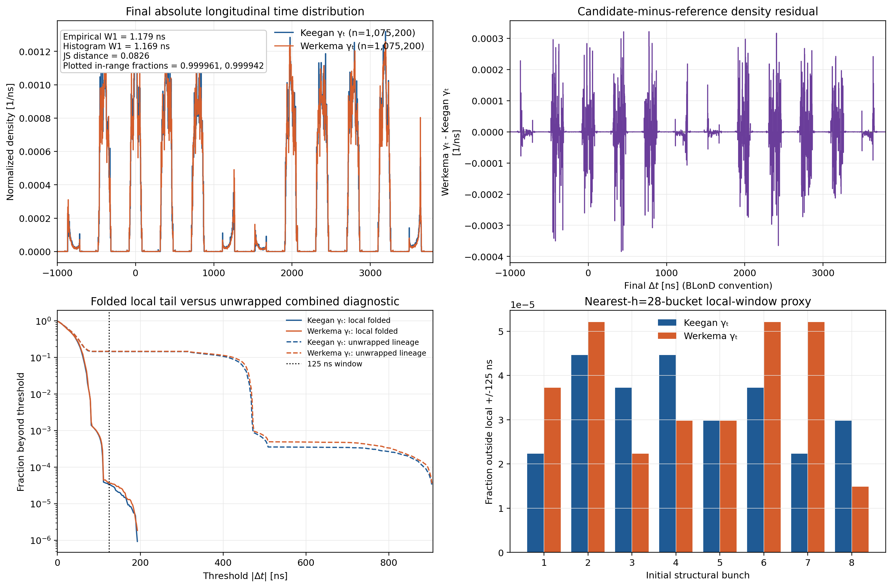
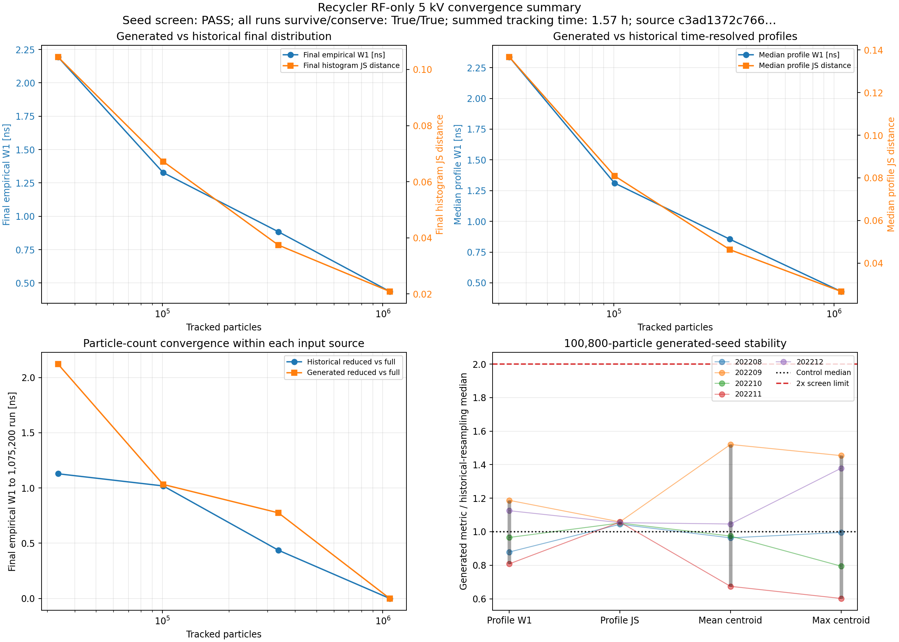
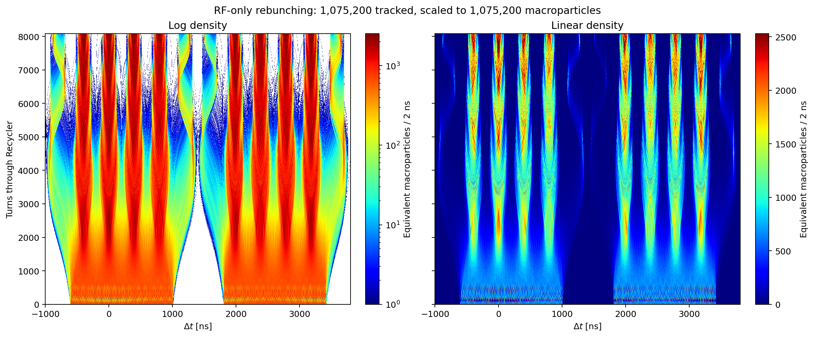
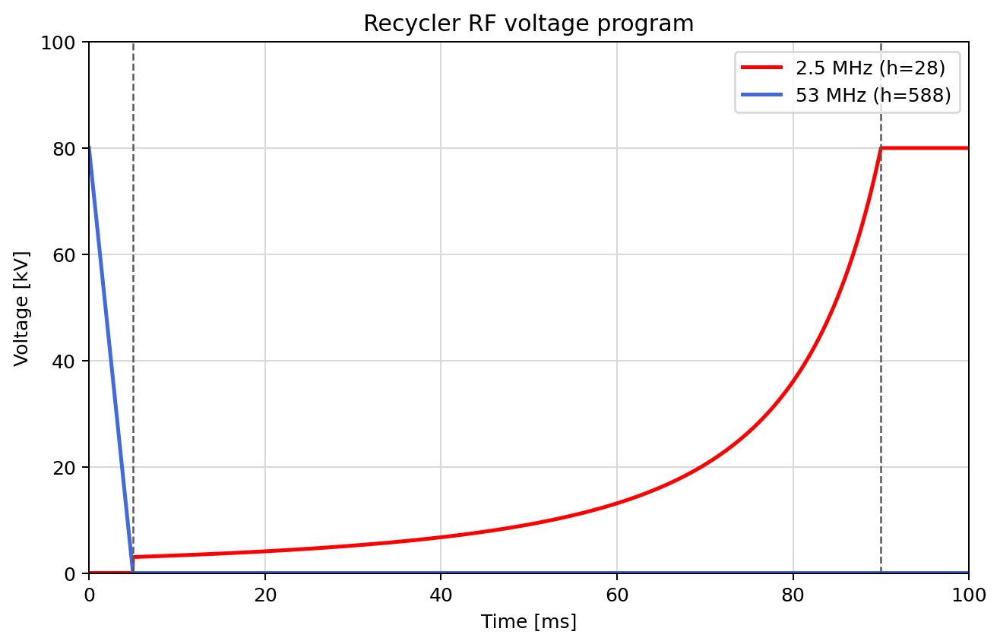
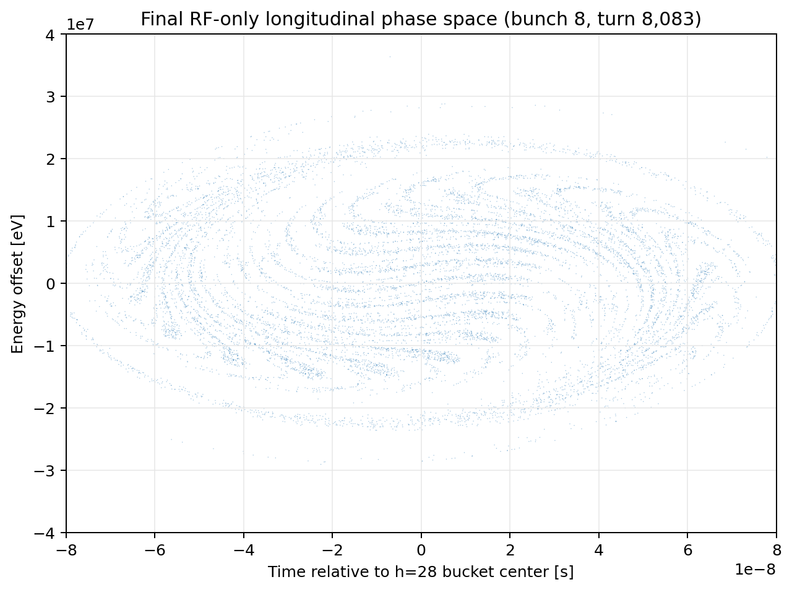
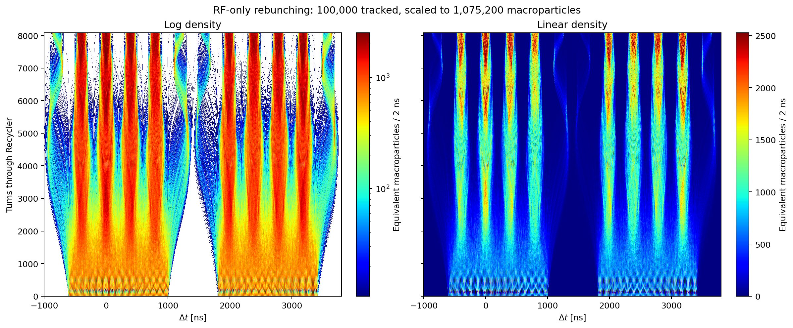
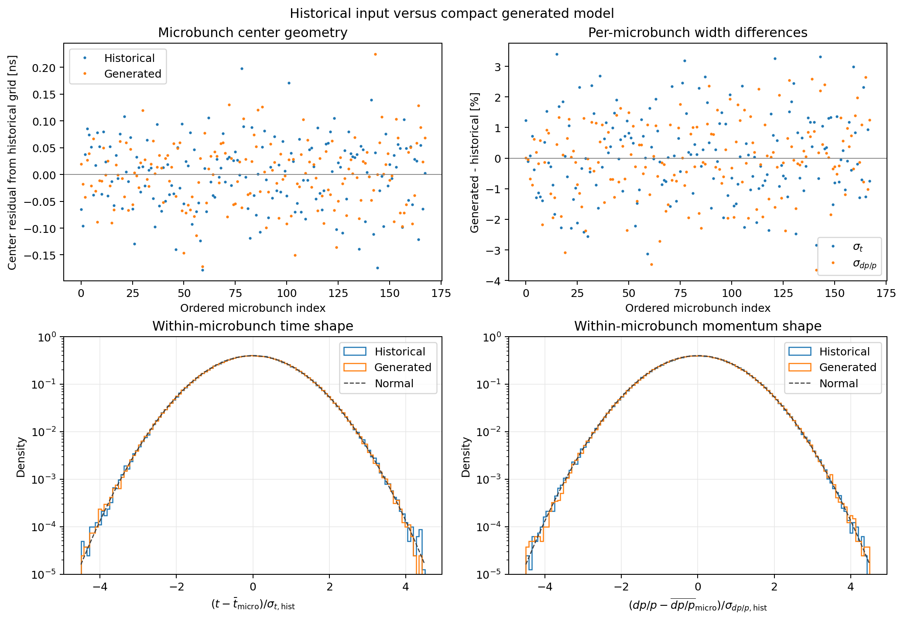
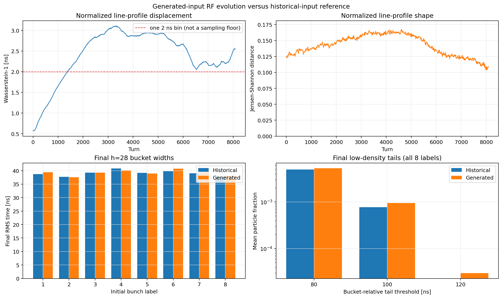
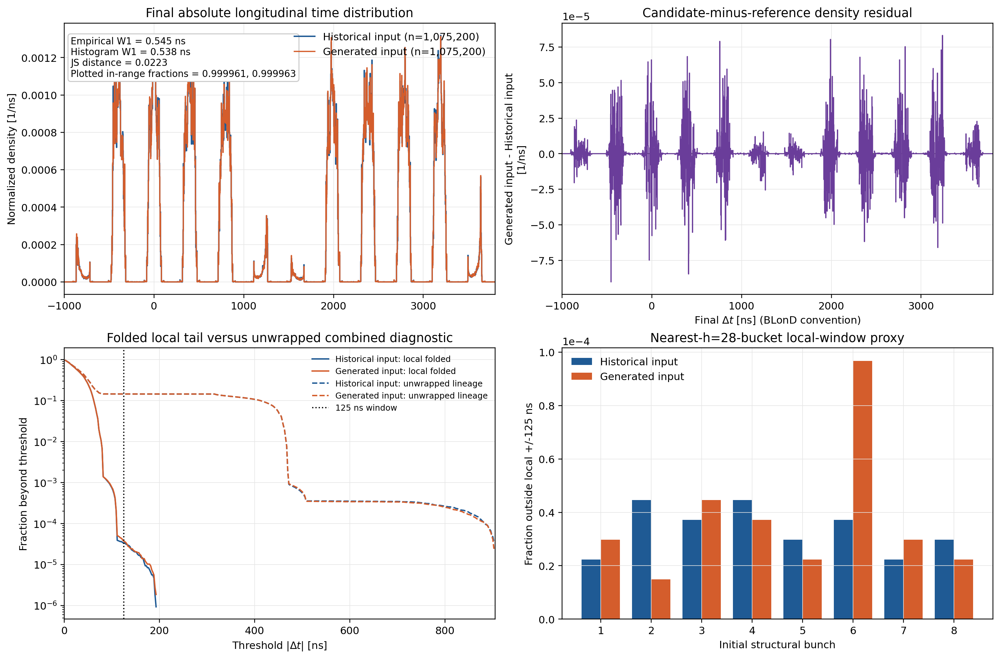

# Results and plot guide

This document explains the plots made by the Xsuite Recycler reconstruction and
records the verified RF-only checkpoints. For installation, commands, inputs,
and parameter definitions, start with [README.md](README.md). The plots and
JSON reports linked below are portable copies under
[`reference_results/`](reference_results/README.md); large HDF5 intermediates
remain regenerable, ignored local outputs.

## Scope of these results

All results below include only the programmed h=588 and h=28 RF systems and the
Recycler longitudinal slip map. They do not include machine impedance,
longitudinal space charge, feedback, noise, transverse motion, apertures, or
losses. Consequently, they test RF capture and the generated input model, not
the paper's complete collective-effects calculation. The transition-gamma
comparison below is one full-statistics endpoint comparison, not a parameter
scan.

## Publication cross-reference

The code and output filenames use physical descriptions rather than publication
figure numbers. The corresponding source figures are:

| Standard plot | IPAC paper | Dissertation |
|---|---:|---:|
| RF voltage program | Figure 5 | Figure 9.6 |
| Final longitudinal phase space | Figure 6 | Figure 9.8 |
| Rebunching waterfall | Figure 7 | Figure 9.10 |

## 3 kV transition-gamma comparison

This comparison tracks the same 1,075,200 historical input rows through the
locked standard RF program: h=588 falls from 80 kV to zero over 5 ms, then h=28
ramps from 3 kV to 80 kV over the next 85 ms. Both runs end after 8,083 turns at
approximately 90 ms. The only independent machine parameter changed is
transition gamma; momentum compaction, slip factor, and the approximate final
synchrotron period are derived from it.

| Quantity | Keegan model | Werkema model | Werkema minus Keegan |
|---|---:|---:|---:|
| Transition gamma | 20.257643837730637 | 21.6 | +1.342356162269365 |
| Momentum compaction `alpha_c` | 0.0024368126329700006 | 0.002143347050754458 | -0.0002934655822155428 |
| Slip factor `eta` | -0.008714928548793705 | -0.009008394131009248 | -0.0002934655822155428 |
| Small-amplitude h=28 period at 80 kV | 18.72423519130096 ms | 18.41672119458596 ms | -0.307513996714999 ms |

All 1,075,200 particles survived with finite final longitudinal coordinates in
both runs. The endpoint shapes differ modestly but resolvably:

| Final-time metric | Result |
|---|---:|
| Exact empirical absolute-time Wasserstein-1 | 1.179087 ns |
| Histogram Wasserstein-1 (2 ns bins) | 1.169369 ns |
| Histogram Jensen--Shannon distance | 0.0826201 |
| Histogram KS distance | 0.00179172 |
| Histogram total-variation distance | 0.0684339 |
| Shared-reference, unwrapped Wasserstein-1 | 2.005945 ns |
| Per-initial-lineage empirical Wasserstein-1 range | 1.890001--2.359017 ns |

### The two 125 ns diagnostics

The primary Werkema-aligned Recycler endpoint proxy is the **folded local
window**. Each particle is assigned to its nearest h=28 bucket, its local time
is wrapped into that bucket, and it is counted outside when
`|dt_local| > 125 ns`. This tests the local RF-pulse shape and deliberately does
not count migration to another h=28 bucket as out of time.

| Endpoint diagnostic | Keegan `gamma_t` | Werkema `gamma_t` | Change |
|---|---:|---:|---:|
| Folded local particles outside +/-125 ns | 36 (0.0033482%) | 39 (0.0036272%) | +3 (+0.0002790 percentage points) |
| Unwrapped initial-lineage particles outside +/-125 ns | 156,202 (14.52772%) | 158,302 (14.72303%) | +2,100 (+0.19531 percentage points) |
| Particles outside the lineage's reference h=28 bucket | 156,191 (14.52669%) | 158,290 (14.72191%) | +2,099 (+0.19522 percentage points) |

The folded counts are sparse, not evidence of a meaningful worsening. Under
the same-row pairing, 75 particles changed folded-window class: 39 moved from
inside to outside and 36 moved from outside to inside, leaving a net increase
of only three. That net is about 0.35 times `sqrt(75)`, and individual-lineage
outside counts are only 2--7 particles. No transition-gamma scan, repeat-run
ensemble, or tail-significance study was performed.

The **unwrapped initial-lineage window** instead subtracts the Keegan run's
reference h=28 center for each initial lineage without modulo wrapping. It is a
combined local-tail-or-reference-bucket-migration diagnostic, which is why its
counts closely follow the separately reported migration totals. It must not be
confused with the folded local-pulse proxy.

Neither 125 ns diagnostic predicts Mu2e extinction. This model stops at the
Recycler endpoint and contains no extraction sequence, Delivery Ring dynamics,
extraction gate, M4 transport, production target, impedance, or space charge.
The HDF5 physical-particle scaling also represents Keegan's `1.05e12` total
intensity, whereas Werkema documents approximately `1e12` per h=28 bunch, or
`8e12` total. The shape fractions and raw simulation counts are therefore the
meaningful comparison; stored physical-proton outside counts must not be read
as Werkema absolute proton predictions.

The Keegan baseline HDF5 predates the enhanced executable-source and invocation
provenance fields. Strict comparison verifies the same full input SHA-256,
particle count, RF program, endpoint, profile grid, and recorded model metadata,
and permits only `gamma_t` plus derived `alpha_c` and `eta` to differ. It does
not cryptographically prove that the legacy baseline used byte-identical
executable source. See the portable [comparison JSON](reference_results/publication_3kv/gamma_transition_full/final_dt_comparison.json)
and [comparison plot](reference_results/publication_3kv/gamma_transition_full/final_dt_comparison.png).

## Archived 5 kV convergence study

This archived matrix uses the 5 kV h=28 starting voltage in Keegan's committed
BLonD driver, explicitly overriding the current locked 3 kV standard. It
contains 16 complete 8,083-turn runs: matched historical/generated pairs at
four particle counts for seed 202208, plus four additional matched pairs at
100,800 particles for seeds 202209--202212. Profiles were recorded every 10
turns.

Every run retained all tracked particles with finite coordinates and conserved
the represented 1,075,200-macroparticle population. The matched seed-202208
differences shrink as the particle count increases:

| Particles per run | Median profile W1 | Median profile JS | Final empirical W1 | Final histogram JS |
|---:|---:|---:|---:|---:|
| 33,600 | 2.336 ns | 0.13669 | 2.193 ns | 0.10442 |
| 100,800 | 1.312 ns | 0.08093 | 1.327 ns | 0.06722 |
| 336,000 | 0.855 ns | 0.04632 | 0.884 ns | 0.03742 |
| 1,075,200 | 0.430 ns | 0.02668 | 0.437 ns | 0.02091 |

At full statistics, the exact final absolute-time W1 is 0.437 ns, about 0.11%
of one 397.666 ns h=28 period. The historical and generated samples place
131,845 and 131,844 particles, respectively, outside their initial label's
historical-reference final bucket: a one-particle difference out of 1,075,200.
Their reference-centered, unwrapped final-time W1 is 0.199 ns.

The full-statistics result is tighter than the sampling variation seen in most
reduced runs. Comparing each reduced endpoint with its own full same-source
endpoint gave empirical W1 values of 1.129, 1.019, and 0.437 ns for the 33,600,
100,800, and 336,000 historical samples, and 2.121, 1.032, and 0.775 ns for the
corresponding generated samples. The 336,000 historical value is essentially
equal to the full generated-versus-historical difference; lower-count sampling
variation is larger.

The five-seed 100,800-particle screen passed every declared coarse criterion.
Relative to four historical-resampling controls, generated median-profile W1
ratios ranged from 0.808 to 1.187 and JS ratios from 1.044 to 1.059. The largest
final per-bunch RMS-time and RMS-energy differences across those seeds were
1.76% and 1.08%. This supports seed stability at reduced size; only seed 202208
has been run at full statistics.

The 16 runs accumulated 5,639.7 seconds of tracking time. The full historical
and generated jobs took 1,559.2 and 1,634.4 seconds and were run concurrently.
The 16 HDF5 intermediates total about 99 MB and remain ignored; the portable
bundle retains selected plots, reports, hashes, exact commands, and provenance:

- [5 kV reference-results guide](reference_results/keegan_5kv/README.md)
- [full time-resolved comparison](reference_results/keegan_5kv/full_comparison/rf_result_comparison.json)
- [full final-time comparison](reference_results/keegan_5kv/full_comparison/final_dt_comparison.json)
- [five-seed screen](reference_results/keegan_5kv/screen_n100800/rf_screen_summary.json)
- [convergence summary JSON](reference_results/keegan_5kv/convergence_summary.json)

### 3 kV versus 5 kV sensitivity

Changing only the h=28 starting voltage for the same full historical input
changes the final distribution materially. The 3 kV-versus-5 kV endpoint has a
global empirical W1 of 5.029 ns and per-bunch W1 values of 7.68--14.64 ns. The
5 kV run has 24,346 fewer particles outside the reference bucket, a reduction
of 2.264 percentage points. This comparison does not establish which voltage
was used for every historical production output; it shows why the source choice
must be stated. The locked 3 kV standard follows the publication/ESME program;
5 kV remains the explicit legacy committed-driver sensitivity. See the
[sensitivity report](reference_results/keegan_5kv/rf_start_voltage_sensitivity.json).

## Archived 3 kV RF voltage program

The blue h=588 system falls linearly from 80 kV to zero during the first 5 ms.
At 5 ms, the red h=28 system begins at 3 kV and follows the inverse-square
adiabatic law to 80 kV at 90 ms. The h=28 voltage then remains at 80 kV.

This archived panel is generated from the RF configuration stored with the run;
it does not use particle coordinates. The 3 kV start follows the paper and
dissertation and is the locked standard program default. Use
`--rf25-start-kv 5` only for the explicitly labeled legacy Keegan-code
sensitivity.

## Archived 3 kV final longitudinal phase space

This is the final state after 8,083 turns of the eighth structural bunch
(zero-based `bunch_index=7`). The horizontal coordinate is wrapped relative to
that sample's nearest h=28 bucket center; the paper's arbitrary absolute
horizontal offset cannot be recovered from the available code or data.

The nested arcs and rings are longitudinal filamentation. Particles near the
bucket center rotate faster than particles at larger phase-space amplitude, so
an initially mismatched group winds into the visible spiral/ring structure.
The shape is qualitatively consistent with the paper's Figure 6/thesis Figure
9.8, but it is not a point-for-point reproduction.

## Archived 3 kV rebunching waterfall

The horizontal axis is BLonD-convention arrival time, the vertical axis is turn
number, and color is the represented number of macroparticles in each 2 ns bin.
The left panel uses logarithmic color normalization to expose weak structures;
the right panel uses linear normalization to show the dense bunch cores. Direct
inspection of the source figure establishes this log-left/linear-right order,
even though the dissertation caption reverses the labels.

At early turns, the approximately 53 MHz microbunch comb is visible. As the
h=588 voltage turns off and h=28 rises, 21 microbunches merge into each of the
eight Recycler bunches. The low-density arcs and neighboring-bucket/satellite
structure are generated by the RF evolution; the reconstructed input generator
does not insert a separate ghost population.

For reduced runs the histogram is scaled to the full 1,075,200-macroparticle
source. The logarithmic floor is therefore quantized by the actual number of
tracked particles. Use the full-statistics result or a convergence study before
interpreting the faintest features quantitatively.

## Generated-input diagnostics

The four panels answer different questions:

- **Microbunch center geometry:** residual center positions relative to the
  common fitted grid. Historical and generated scatter are consistent with
  finite sampling.
- **Per-microbunch width differences:** fractional deviations of each time and
  momentum width from the historical pooled width.
- **Within-microbunch time shape:** standardized historical and generated time
  residuals compared with a normal distribution.
- **Within-microbunch momentum shape:** the equivalent standardized `dp/p`
  comparison.

The full-row static comparison found:

| Metric | Result |
|---|---:|
| Microbunch-center RMSE | 0.0834 ns |
| Pooled time-width difference | +0.087% |
| Pooled momentum-width difference | -0.050% |
| Global mean `dp/p` difference | `1.21e-7` |
| Standardized time W1 / split-half control | 1.037 |
| Standardized momentum W1 / split-half control | 1.040 |
| Sliced two-dimensional W1 / split-half control | 0.608 |

The declared static calibration screen passes. This is an adequacy check after
fitting the model to the historical input, not independent proof of the
original generator or random seed.

Files:

- [input_model_comparison.json](reference_results/input_model/input_model_comparison.json)
- [input_model_diagnostics.png](reference_results/input_model/input_model_diagnostics.png)

## Archived 3 kV reduced dynamic comparison

This comparison tracks 33,600 particles in each run: 200 particles from every
historical microbunch versus 200 newly generated particles per microbunch. The
top row shows turn-by-turn line-profile displacement (Wasserstein-1) and shape
difference (Jensen--Shannon). The lower row compares final h=28 bucket widths
and modulo-wrapped local tails.

Three generated seeds were compared with one historical reference and two
additional historical-resampling controls:

- generated median profile W1 was 0.895--0.996 times the historical-resampling
  baseline;
- generated median Jensen--Shannon distance was 1.010--1.014 times the
  historical-resampling baseline;
- maximum final per-bunch RMS time or energy discrepancy was below 2.3%;
- every particle survived with finite coordinates and represented population
  was conserved;
- the declared coarse dynamic screen passed.

The lower-right `|dt|` thresholds in this older comparison are computed after
wrapping each particle into one h=28 period. They describe the local bunch
shape; they are not counts of particles that changed to a neighboring bucket.

Files:

- [seed-202208 comparison report](reference_results/publication_3kv/dynamic_33k6/rf_result_comparison_seed202208.json)
- [aggregate three-seed screen](reference_results/publication_3kv/dynamic_33k6/rf_screen_summary.json)

## Archived 3 kV full final-time comparison

The upper panels overlay the normalized absolute arrival-time distributions
and show generated-minus-historical density. The lower-left panel separates
the nearest-bucket folded local tail from the unwrapped initial-lineage
tail-or-migration diagnostic, with 125 ns marked. The lower-right panel shows
the exact folded local outside-125 ns fraction for each initial bunch label.

Both runs used seed 202208 where a seed is relevant, the explicit 3 kV
publication/ESME RF program that is now the locked standard, and all 8,083
turns. Each took approximately 1,431 seconds while the two jobs ran
concurrently. Both retained all 1,075,200 particles with finite final
coordinates.

| Final absolute-time metric | Result |
|---|---:|
| Exact empirical Wasserstein-1 | 0.5454 ns |
| Histogram Wasserstein-1 (2 ns bins) | 0.5377 ns |
| Jensen--Shannon distance | 0.02225 |
| Histogram KS distance | 0.000604 |
| Total variation distance | 0.01497 |
| Generated minus historical mean time | -0.1919 ns |
| Generated minus historical RMS-width | +0.1111 ns |
| Per-initial-bunch empirical W1 range | 0.3566--1.2869 ns |

The empirical W1 is 0.137% of the 397.666 ns h=28 period. The two absolute
curves and satellite peaks lie nearly on top of each other.

### Reference-bucket occupancy

Each initial structural bunch label is assigned the h=28 bucket containing the
median of its historical endpoint. That same bucket definition is applied to
both samples without modulo wrapping.

| Endpoint quantity | Historical | Generated |
|---|---:|---:|
| Particles outside label's reference bucket | 156,191 | 156,178 |
| Fraction outside | 14.52669% | 14.52548% |
| Initially outside these endpoint-defined boundaries | 51,990 (4.8354%) | 52,046 (4.8406%) |
| In-reference to outside transition | 123,260 | 123,223 |
| Outside to in-reference transition | 19,059 | 19,091 |
| Total particles changing class | 142,319 | 142,314 |

The endpoint outside-bucket totals differ by only 13 particles. This close
agreement shows that the compact generated realization preserves the RF-driven
bucket-transition behavior of the historical input. It does not mean the
particles are paired one-to-one, and it does not prove the exact historical RNG
or generation algorithm.

Files:

- [full comparison JSON](reference_results/publication_3kv/final_time_full/final_dt_comparison_seed202208.json)
- [comparison plot](reference_results/publication_3kv/final_time_full/final_dt_comparison_seed202208.png)
- [artifact hashes and full regeneration commands](reference_results/manifest.json)

The two full-run HDF5 files are intentionally omitted from the portable bundle.
Their SHA-256 hashes are retained in the manifest so regenerated intermediates
can still be checked.

## Archived 3 kV 100,000-particle reconstruction checkpoint

The representative standard plots above are archived under
`reference_results/publication_3kv/standard_historical_100k/`. This run used
100,000 deterministically stratified historical particles, all 8,083 turns,
profiles every 10 turns, and the explicit 3 kV paper RF sequence.

- Tracking time was 181.9 s on the development host.
- All 100,000 particles survived with finite final coordinates.
- It saved 810 profiles of 2,400 bins each.
- Every profile plus its outside-window count represents 1,075,200
  macroparticles to floating-point precision.
- Input SHA-256 was
  `3b591b8381cb7cf57a88d7db08d535f2de182720d9fcb3c335800d7b3283e7e1`.

This checkpoint is appropriate for qualitative inspection of capture and
filamentation. Its faint logarithmic features remain sample-quantized.

## Conclusions

Within this RF-only model:

1. Both tested RF variants produce the expected eight-bunch capture,
   filamentation, and neighboring-bucket structure.
2. The compact equal-population Gaussian microbunch generator is statistically
   close to the historical input.
3. In the archived 5 kV committed-driver variant, a full generated realization
   reproduces the historical final arrival-time distribution to 0.437 ns W1
   and differs by one particle in the reference-bucket outside count.
4. No ghost or satellite component needs to be inserted explicitly to obtain
   the observed RF-only neighboring-bucket structure.
5. The 3 kV-versus-5 kV choice measurably changes the endpoint, so it is retained
   as an explicit, provenance-labeled model choice.
6. At the locked 3 kV RF setting, changing `gamma_t` from Keegan's value to
   Werkema's changes the endpoint shape and reference-bucket migration, while
   the sparse folded local +/-125 ns count changes by only three particles.

The strongest justified claim is dynamic equivalence for the tested RF-only
case. These results do not establish the exact original input script, validate
multiple full-statistics generator seeds, or reproduce the paper's impedance
and space-charge results. The five reduced-size generated seeds establish a
useful stability check, not a substitute for multiple full runs.

## Known limitations and next steps

- Add impedance only as a documented normalization study until the 4x/6x/9x
  source discrepancy is resolved.
- A faithful space-charge result remains blocked by the missing effective
  longitudinal model and beam-pipe/transverse inputs.
- Repeat the full generated run for several seeds only if full-statistics tail
  stability, beyond the five-seed 100,800-particle screen, is needed.
- Treat absolute waterfall color normalization as reconstruction-specific; the
  publication's count/proton normalization is not fully recoverable.
- Do not infer particle-by-particle agreement from distribution-level metrics.

The current automated suite contains 88 passing tests covering RF endpoints,
coordinate mapping, generator reproducibility, tracking, HDF5 provenance,
population conservation, CLI source selection, documentation coverage, plot
naming, input/result comparisons, controlled transition-gamma compatibility,
and folded and unwrapped 125 ns diagnostics.
